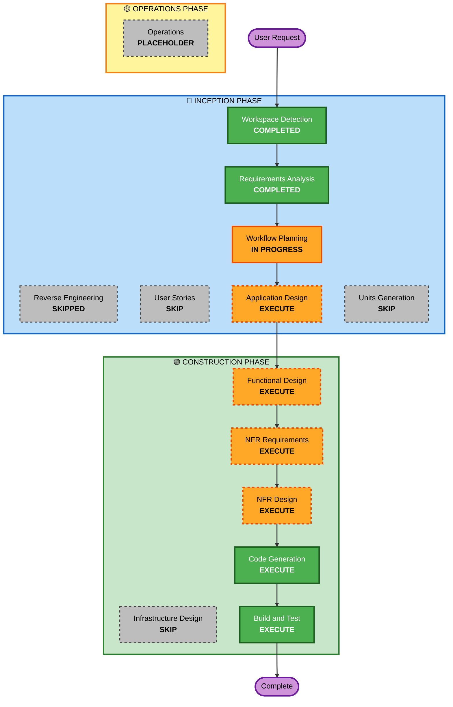

# Execution Plan - MindMirror AI

## Detailed Analysis Summary

### Project Type
**Greenfield** - New single-page application with no existing codebase

### Change Impact Assessment

**User-facing changes**: YES
- Complete emotional intelligence dashboard
- Real-time sentiment analysis interface
- Interactive charts and visualizations
- Responsive design across all devices

**Structural changes**: N/A (New project)
- Single-page React application architecture
- Client-only architecture with no backend
- localStorage-based data persistence

**Data model changes**: YES
- User journal entries data structure
- Sentiment analysis results schema
- Historical mood trends data model
- User preferences and settings

**API changes**: N/A (No external APIs)
- Self-contained application
- No API contracts or integrations

**NFR impact**: YES
- Performance optimization for animations
- Security baseline enforcement
- Accessibility requirements
- Responsive design implementation

### Risk Assessment
- **Risk Level**: LOW-MEDIUM
- **Rollback Complexity**: Easy (static file deployment)
- **Testing Complexity**: Moderate (sentiment analysis logic, UI interactions, localStorage)
- **Deployment Risk**: Minimal (single HTML file, no server dependencies)

---

## Workflow Visualization

### Text Alternative

**Phase 1: INCEPTION**
- Stage 1: Workspace Detection (COMPLETED)
- Stage 2: Reverse Engineering (SKIPPED - Greenfield project)
- Stage 3: Requirements Analysis (COMPLETED)
- Stage 4: User Stories (SKIP - Simple single-user application)
- Stage 5: Workflow Planning (IN PROGRESS)
- Stage 6: Application Design (EXECUTE - Component architecture needed)
- Stage 7: Units Generation (SKIP - Single cohesive unit)

**Phase 2: CONSTRUCTION**
- Stage 8: Functional Design (EXECUTE - Sentiment analysis logic design)
- Stage 9: NFR Requirements (EXECUTE - Performance, security, accessibility)
- Stage 10: NFR Design (EXECUTE - Animation optimization, security patterns)
- Stage 11: Infrastructure Design (SKIP - No infrastructure, static deployment)
- Stage 12: Code Generation (EXECUTE - Implementation)
- Stage 13: Build and Test (EXECUTE - Build single HTML, test functionality)

**Phase 3: OPERATIONS**
- Stage 14: Operations (PLACEHOLDER - Future deployment workflows)

---

## Phases to Execute

### 🔵 INCEPTION PHASE

- [x] **Workspace Detection** - COMPLETED
  - Determined greenfield project with no existing code

- [x] **Reverse Engineering** - SKIPPED
  - **Rationale**: Greenfield project, no existing codebase to analyze

- [x] **Requirements Analysis** - COMPLETED
  - Gathered comprehensive functional and non-functional requirements
  - Configured security baseline and property-based testing extensions

- [ ] **User Stories** - SKIP
  - **Rationale**: Single-user application with clear requirements. User stories would not add significant value for this straightforward use case. The requirements document already captures all necessary user interactions and acceptance criteria.

- [x] **Workflow Planning** - IN PROGRESS
  - Creating comprehensive execution plan

- [ ] **Application Design** - EXECUTE
  - **Rationale**: Need to design component architecture for React application including:
    - Component hierarchy and structure
    - State management approach
    - Sentiment analysis engine architecture
    - Data flow between components
    - localStorage service design
    - Chart integration patterns

- [ ] **Units Generation** - SKIP
  - **Rationale**: Single cohesive application unit. The entire application will be developed as one integrated unit rather than multiple independent units. No decomposition needed for this scope.

### 🟢 CONSTRUCTION PHASE

- [ ] **Functional Design** - EXECUTE
  - **Rationale**: Need detailed design for:
    - Sentiment analysis algorithm (keyword matching, negation handling, intensity modifiers)
    - Score calculation formulas for 6 emotional metrics
    - Mood detection logic
    - Suggestion generation algorithm
    - Data persistence schema for localStorage
    - Chart data transformation logic

- [ ] **NFR Requirements** - EXECUTE
  - **Rationale**: Need to assess and document:
    - Performance targets for animations (60fps)
    - Device performance detection strategy
    - Security implementation approach (CSP, input validation)
    - Accessibility implementation details
    - Browser compatibility testing approach
    - Tech stack finalization (React 18.2.0, Vite 8.x, etc.)

- [ ] **NFR Design** - EXECUTE
  - **Rationale**: Need to design patterns for:
    - Animation performance optimization
    - Security controls (input sanitization, CSP meta tag)
    - Responsive design breakpoints
    - Accessibility features (ARIA labels, keyboard navigation)
    - Error handling and toast notifications
    - Development vs production mode switching

- [ ] **Infrastructure Design** - SKIP
  - **Rationale**: No infrastructure required. Static HTML file deployment to Netlify requires no infrastructure design. No servers, databases, or cloud resources needed.

- [ ] **Code Generation** - EXECUTE (ALWAYS)
  - **Rationale**: Implementation of all components, sentiment analysis engine, UI, and build configuration
  - **Part 1**: Planning - Create detailed code generation plan
  - **Part 2**: Generation - Execute plan to generate all code

- [ ] **Build and Test** - EXECUTE (ALWAYS)
  - **Rationale**: Build single index.html file, test sentiment analysis, UI interactions, and localStorage persistence

### 🟡 OPERATIONS PHASE

- [ ] **Operations** - PLACEHOLDER
  - **Rationale**: Future deployment and monitoring workflows (not applicable for static site)

---

## Execution Summary

### Stages to Execute: 8
1. Application Design (INCEPTION)
2. Functional Design (CONSTRUCTION)
3. NFR Requirements (CONSTRUCTION)
4. NFR Design (CONSTRUCTION)
5. Code Generation - Planning (CONSTRUCTION)
6. Code Generation - Generation (CONSTRUCTION)
7. Build and Test (CONSTRUCTION)
8. (Workflow Planning - current stage)

### Stages to Skip: 5
1. Reverse Engineering (Greenfield project)
2. User Stories (Clear requirements, single-user app)
3. Units Generation (Single cohesive unit)
4. Infrastructure Design (No infrastructure needed)
5. Operations (Placeholder for future)

### Estimated Timeline
- **Total Active Stages**: 8 stages
- **Estimated Duration**: 2-3 hours of AI-assisted development
- **Complexity**: Moderate (sentiment analysis logic + rich UI)

---

## Success Criteria

### Primary Goal
Deliver a production-ready, single-file MindMirror AI application that analyzes user emotions in real-time and updates the dashboard dynamically.

### Key Deliverables
1. ✅ Single `index.html` file with all CSS/JS inlined
2. ✅ Working sentiment analysis engine with advanced context handling
3. ✅ Dynamic dashboard with 6 emotional metrics
4. ✅ Three animated charts (mood trend, emotional distribution, productivity/focus)
5. ✅ Fully responsive design (mobile, tablet, desktop)
6. ✅ localStorage persistence for complete history
7. ✅ Toggle between manual and auto-analyze modes
8. ✅ Security baseline compliance
9. ✅ Property-based tests for pure functions
10. ✅ Zero build errors or console warnings

### Quality Gates
- **Functional**: All sentiment analysis features working correctly
- **Performance**: Smooth 60fps animations on capable devices
- **Security**: All SECURITY rules satisfied (input validation, CSP, error handling)
- **Accessibility**: Basic accessibility features implemented
- **Testing**: Property-based tests for sentiment analysis and serialization
- **Deployment**: Successful drag-and-drop deployment to Netlify

---

## Next Steps

Upon approval of this execution plan:
1. Proceed to **Application Design** stage
2. Design component architecture and system structure
3. Continue through CONSTRUCTION phase stages
4. Complete with Build and Test

---

**Document Version**: 1.0  
**Created**: 2026-05-07  
**Status**: Awaiting Approval
